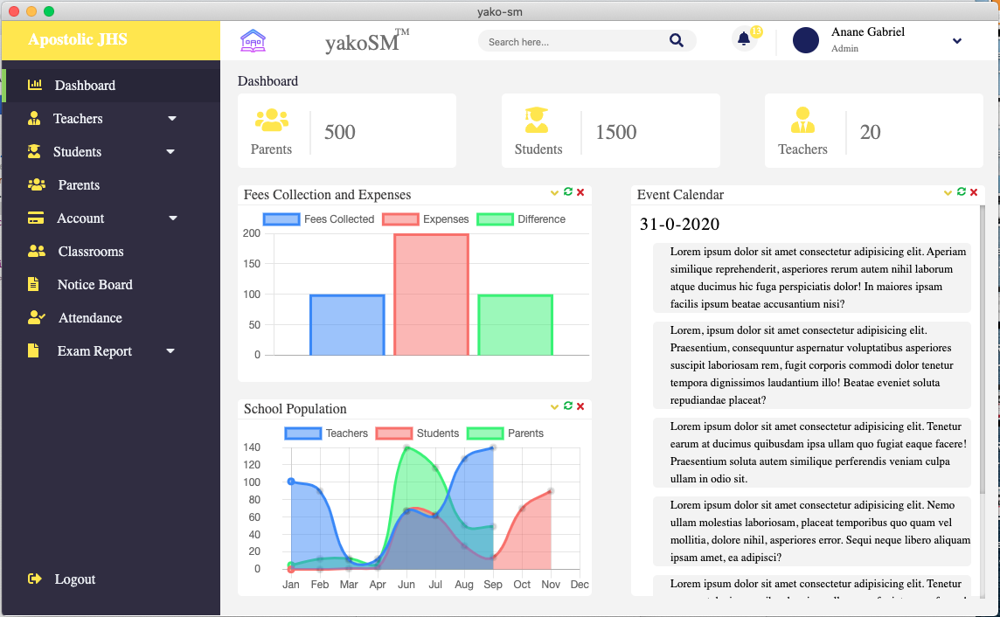

# yako-sm

yako-sm is a school management application which helps school administrators management their school.

## Screenshot


## Project Structure

The default structure of Vuejs frontend application generated by the vue-cli and vue-electron-builder is still maintained with this project. But some other folders are being created to management the project structure well.

Check the .gitignore file to see all the files and folders that will be ignore because some are auto-generated by the IDE, log files, editor files and folders etc.

### Folders you will be working with are:

- <b>models/</b> contains the database schema, scripts to interact the db and cache data

- <b>public/</b> hooks the DOM

- <b>src/</b> contains the <b>assets/</b> (contains static files such as images, js etc), <b>components/</b> (contains the reusable components), <b>utils/</b>(which also contains helper functions) and <b>views/</b>(which contains the <b>screens/</b> with pop up screens and other frontend)

### Files you will be working with:

- <b>App.vue</b> renders the routes

- <b>background.js</b> contains the electron main process and also all screens config goes here

- <b>main.js</b> root of the application

- <b>router.js</b> routes config file

- <b>store.js</b> state management file

## Project setup
```
npm install
```

### Compiles and hot-reloads for development
```
npm run electron:serve
```

### Compiles and minifies for production
```
npm run electron:build
```

### Run your tests
```
npm run test
```

### Lints and fixes files
```
npm run lint
```


### Customize configuration
See [Configuration Reference](https://cli.vuejs.org/config/).
